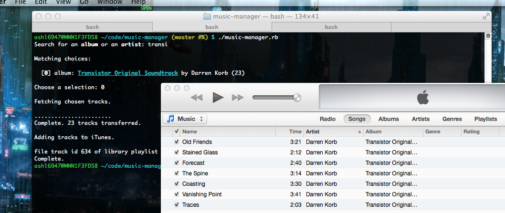

# Music Manager

I've got a bunch of music stashed in a backup on a Linux machine downstairs. It takes up a lot of
disk space, so I'd rather not `rsync` it everywhere I want to listen, and I'd also rather not
shuttle things around by hand and have to worry about keeping everything up to date everywhere.

Hence, this script. It lets me search my music downstairs for artists or albums, shows me matching
tracks, copies the one I pick into a local directory, and adds them to iTunes.

It's also an unholy abomination of Ruby, bash scripting, and shelling out to AppleScript.



## Installation

I'm not going to package this as a gem or anything unless anyone else actually wants me to.

Instead, you have to grab it from `git` the old-fashioned way:

```bash
mkdir ~/code/
git clone https://github.com/smashwilson/music-manager.git ~/code/music-manager
cd ~/code/music-manager
bundle install
```

To run it, I've got a bin script in my [dotfiles](https://github.com/smashwilson/dotfiles) for
convenience:

```bash
#!/bin/bash
#
# Run music-manager.

cd ${HOME}/code/music-manager
bundle exec ruby music-manager.rb
```
